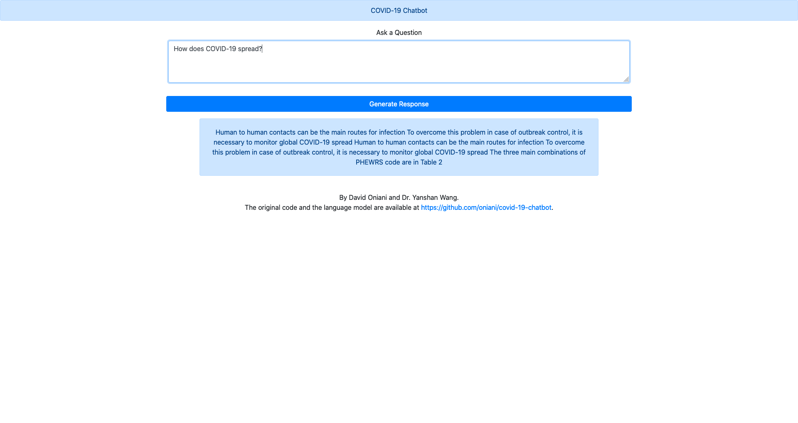

# COVID-19 Chatbot

**Please note that the health information generated by the chatbot is for general research purposes
only. It is not a diagnostic tool, nor is it a substitute for medical advice or treatment for
specific conditions.**

## Paper

Our work has been accepted at [ACM-BCB](https://acm-bcb.org/).
The paper is available [here: https://dl.acm.org/doi/abs/10.1145/3388440.3412413](https://dl.acm.org/doi/abs/10.1145/3388440.3412413).

## Dataset

The dataset is the initial _commercial use subset_ taken from
[COVID-19 Open Research Dataset (CORD-19)](https://pages.semanticscholar.org/coronavirus-research)
and consists of 9000 scholarly articles.

For the training purposes, we have extracted the abstract and the main body of
these articles and have merged them together.

For (re)extracting the data, run the command below.

```sh
python3 extract.py
```

## Model

We have retrained GPT-2 774M model with the COVID-19 corpus.

The model was trained using the Adam optimizer with the learning rate of
0.0001. It went through 2500 iterations with the batch size of 8.

The model is hosted and available at this [Google Drive link](https://drive.google.com/open?id=1-BnJ5uCb2kwS2eg5qupZV2vvDbRxDRU_).

## Chatbot

Once you have downloaded the model, and put the model inside the `models`
directory. Afterward, to run the chatbot, execute the sequence of commands
shown below.

```sh
git clone https://github.com/oniani/covid-19-chatbot
cd covid-19-chatbot
python3 -m pip install -r requirements.txt
PYTHONPATH=src python3 -W ignore interact.py
```

### Web Application



For running the web application, navigate to the `web-app` directory and run
`flask run` (it should be hosted on port 5000, usually).

## Transfer Learning

It is also possible to run transfer learning with your own data.

Google Colaboratory (re)training example:

```python
# Mount the drive
from google.colab import drive
drive.mount("/content/drive")

# Set up the repository
%cd "/content/drive/My Drive"
!mkdir COVID-19_CHATBOT
!rm -rf gpt-2
!git clone https://github.com/oniani/gpt-2 "/content/drive/My Drive/COVID-19_CHATBOT/gpt-2/"
%cd COVID-19_CHATBOT/gpt-2/

# Install the pretrained model and its dependencies
!python3 -m pip install -r requirements.txt
!python3 download_model.py 774M

# Install additional dependencies
!python3 -m pip install fire==0.2.1 \
                        tensorflow-gpu==1.14 \
                        tensorflow-hub==0.7.0 \
                        toposort==1.5

# Run the transfer learning training
#
# NOTE: You will need to upload `data` folder from this repository and put it
# into the `COVID-19_CHATBOT` directory
!PYTHONPATH=src python3 train.py --dataset="/content/drive/My Drive/COVID-19_CHATBOT/data" \
                                 --model_name=774M \
                                 --batch_size=8 \
                                 --optimizer=adam \
                                 --learning_rate=0.0001 \
                                 --save_time=-1 \
                                 --sample_every=-1 \
                                 --save_every=500 \
                                 --init_tpu
```

Special thanks to [@shawwn](https://github.com/shawwn) for making GPT-2 TPU-trainable on Google
Colaboratory.

## Results

The results are also available in a single file [here](https://github.com/oniani/covid-19-chatbot/blob/master/results/answers_all.csv).

## Future Work

The work we would like to see in the future includes retraining the model with a different dataset,
tweaking the hyperparameters, and/or applying the larger GPT-2 model (1.5B parameters).

## Authors

[David Oniani][david] and [Dr. Yanshan Wang][drwang].

## Implementation

[covid-19-chatbot][covid-19-chatbot] has been implemented by [David Oniani][david].

[david]: https://oniani.ai
[drwang]: https://sites.pitt.edu/~yaw89/
[covid-19-chatbot]: https://github.com/oniani/covid-19-chatbot
